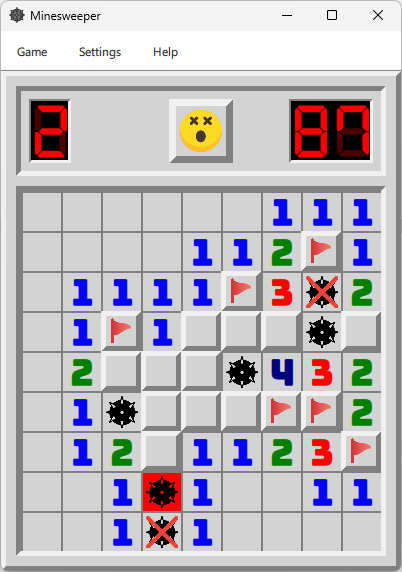
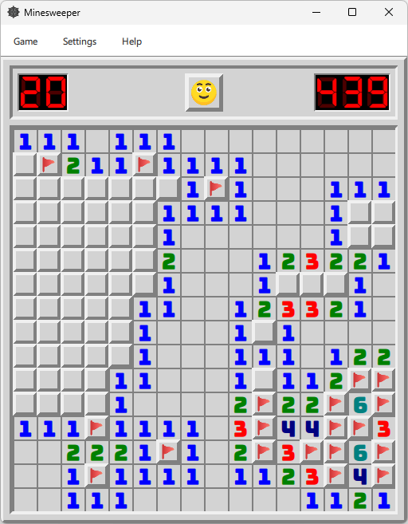
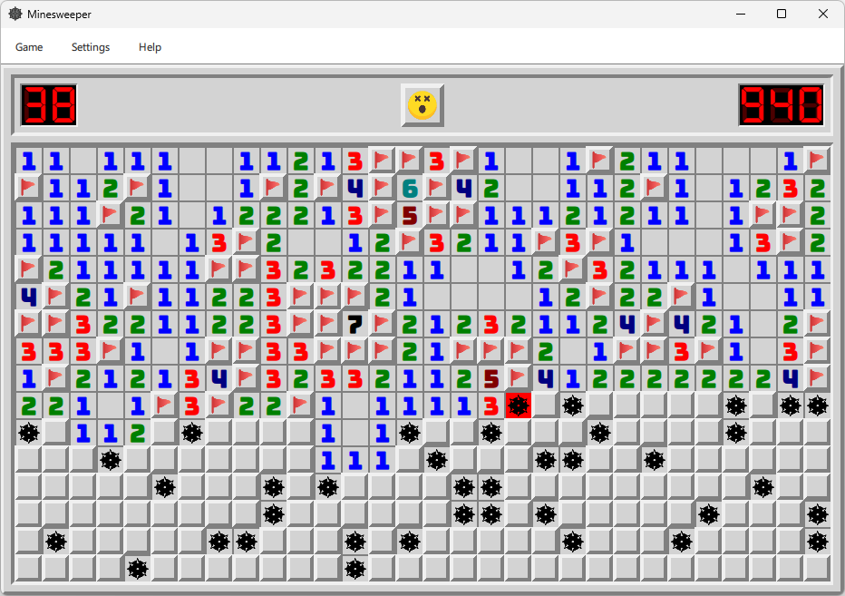
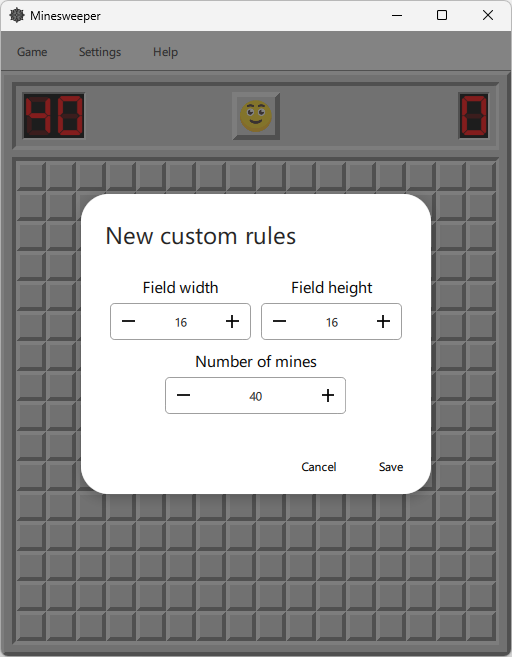
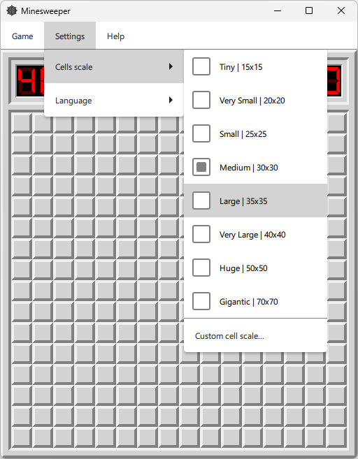

# Minesweeper_Qt

<a href="https://dariarty.github.io/Minesweeper_Qt/" title="GitHub Pages link">Play in browser - WebAssembly version hosted on GitHub Pages</a>

Minesweeper game with improved classic GUI. 
Cross-platform application made with C++/Qt/QML for Windows, Linux and WebAssembly. 

## Features

* Classic minesweeper gameplay with fancy GUI 
* Customizable difficulty options (field height and width, number of mines) 
* Resizable scale of field 
* Desktop and WebAssembly versions 

## Screenshots

<h3 align="center">Beginner</h3>

  

<h3 align="center">Intermediate</h3>

  

<h3 align="center">Expert</h3>

  

<h3 align="center">Dialog for choosing custom game rules</h3>

  

<h3 align="center">Settings to change field zoom</h3>

  

## Attributions
<a href="https://www.flaticon.com/free-icons/mine" title="mine icons">Mine icons created by Creaticca Creative Agency - Flaticon</a>  

<a href="https://www.flaticon.com/free-icon/close_1828666?term=cross&page=1&position=9&origin=search&related_id=1828666" title="cross icon">Cross icon created by Pixel Perfect - Flaticon</a>  

<a href="https://www.flaticon.com/packs/emojis-221" title="emoji icons">Emoji icons for reset button created by NajmunNahar - Flaticon</a>  

<a href="https://www.freepik.com/icon/flag_16771882#fromView=keyword&page=1&position=91&uuid=a58f54fa-5ea7-4ac9-9fae-a7f2fb24842f" title="flag icon">Flag icon created by sonnycandra - Freepik</a>

## License

Distributed under the MIT License. See [LICENSE](LICENSE) for more information.

