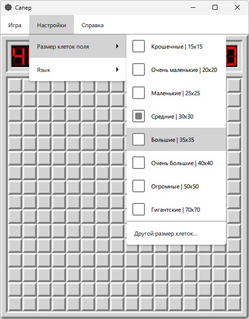

# Minesweeper_Qt

[](https://github.com/Dariarty/Minesweeper_Qt/blob/main/README.md)
[](https://github.com/Dariarty/Minesweeper_Qt/blob/main/README.ru.md)

<a href="https://dariarty.github.io/Minesweeper_Qt/" title="GitHub Pages link">Играть в браузере - версия WebAssembly на хостинге GitHub Pages</a>

Игра "Сапер" с улучшенным классическим GUI.</br>
Кроссплатформенное приложение, написанное на C++/Qt/QML для Windows, Linux и WebAssembly.</br>

## Функции приложения

* Классический геймплей сапера с красивым интерфейсом</br>
* Настраиваемая сложность игры (Ширина и высота поля, количество мин)</br>
* Настраиваемый масштаб клеток</br>
* Поддержка сборки для десктопа и WebAssembly</br>

## Скриншоты

<h3 align="center">Новичок</h3>
<p align="center">
  
</p>

<h3 align="center">Любитель</h3>
<p align="center">
  
</p>

<h3 align="center">Эксперт</h3>
<p align="center">
  
</p>

<h3 align="center">Диалог для пользовательских настроек игры</h3>
<p align="center">
  
</p>

<h3 align="center">Настройки для выбора масштаба клеток</h3>
<p align="center">
  
</p>

## Сборка исходного кода
Приложение поддерживает сборку для Windows, Linux и WebAssembly (с использованием Qt for WebAssembly). </br>
Зависимости: Qt 6.5+, GCC (или другой) компилятор C++, Qt Creator, Qt Linguist </br>
1.  Загрузить и установить Qt6 и Qt Creator.</br>
2.  Настроить в Qt Creator сборку под Desktop или WebAssembly с использованием Emscripten. </br>
3.  Склонировать репозиторий.
     ```sh
     git clone https://github.com/Dariarty/Minesweeper_Qt.git
     ```
4.  Открыть файл проекта src/minesweeper.pro в Qt Creator.</br>
5.  Запустить команду lrelease для чтения файлов TS и генерации файлов перевода QM. </br>
    Qt Creator > Tools > External > Linguist > Release Translations (lrelease) </br>
6.  Запустить qmake.</br>
7.  Собрать проект в Qt Creator.</br>

## Атрибуция
<a href="https://www.flaticon.com/free-icons/mine" title="mine icons">Иконки мин созданы Creaticca Creative Agency - Flaticon</a> </br>

<a href="https://www.flaticon.com/free-icon/close_1828666?term=cross&page=1&position=9&origin=search&related_id=1828666" title="cross icon">Иконка крестика создана Pixel Perfect - Flaticon</a> </br>

<a href="https://www.flaticon.com/packs/emojis-221" title="emoji icons">Эмодзи для кнопки новой игры созданы NajmunNahar - Flaticon</a> </br>

<a href="https://www.freepik.com/icon/flag_16771882#fromView=keyword&page=1&position=91&uuid=a58f54fa-5ea7-4ac9-9fae-a7f2fb24842f" title="flag icon">Иконка флажка создана sonnycandra - Freepik</a>

## Лицензия

Распространяется под MIT License. Смотри [LICENSE](LICENSE) для полной информации.

